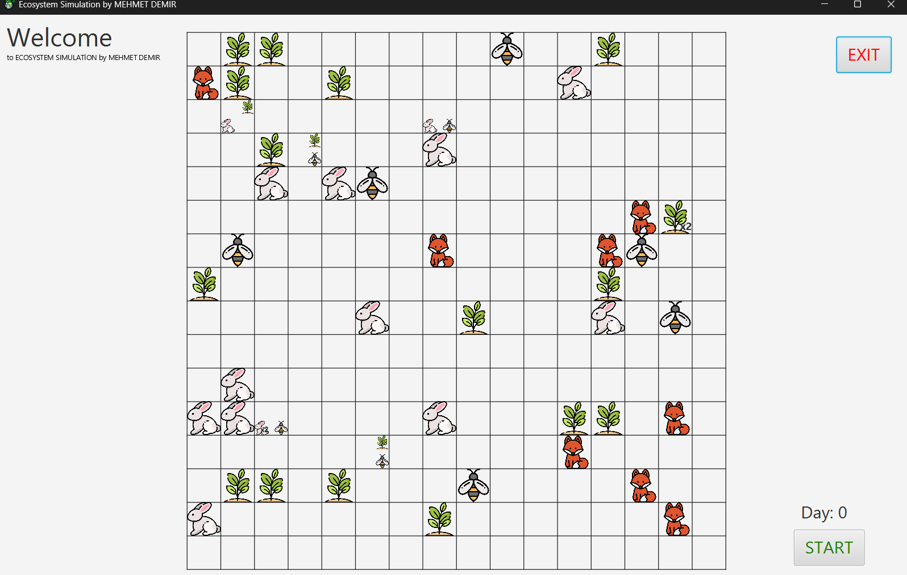
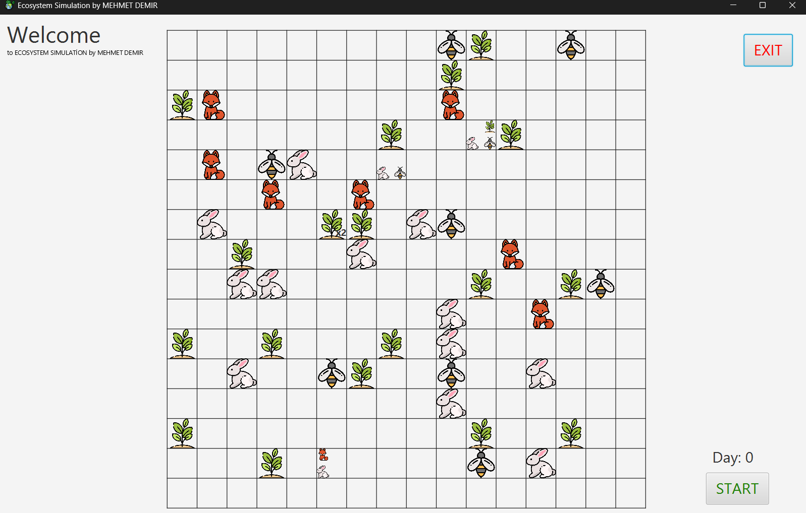
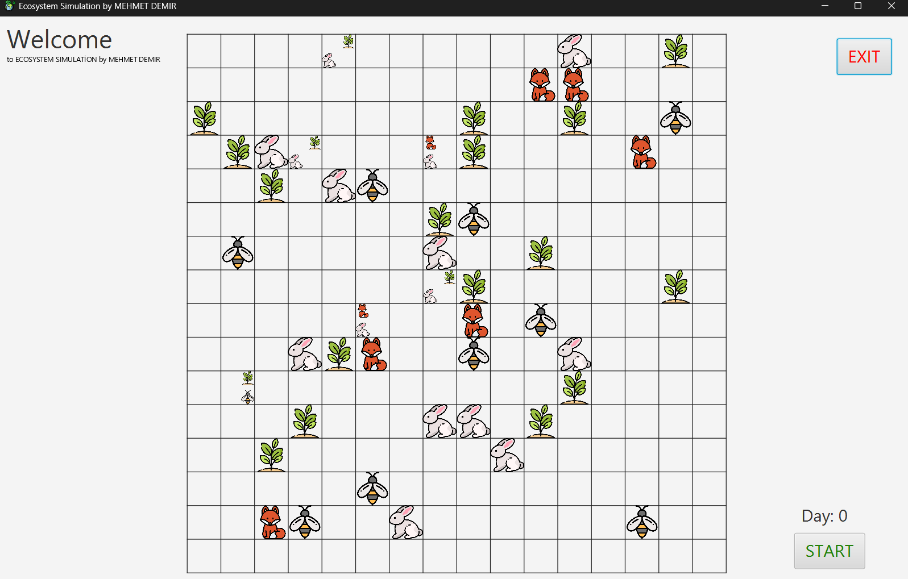
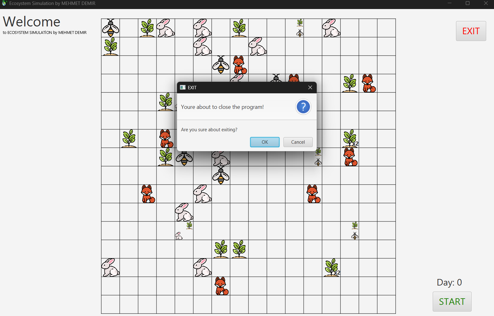
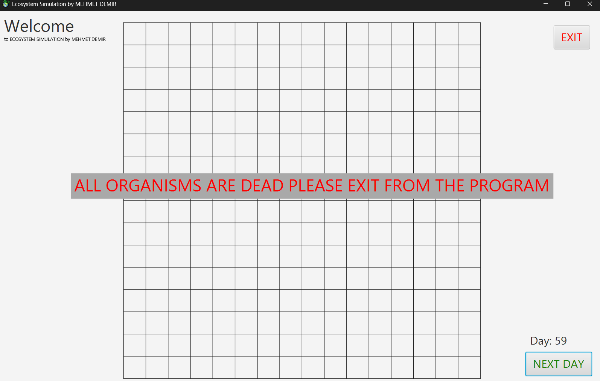

# Ecosystem Simulation

An object-oriented artificial ecosystem simulation built with Java and JavaFX. Plants, bees, rabbits, and foxes interact on a 15x15 grid, with each simulated day driven by feeding, temperature and toxin exposure, predation, and evasion behavior.

**Java 24+ · JavaFX 26**

---

## Screenshots

| Screenshot Running 1 | Screenshot Running 2 | Screenshot Running 3 |
|:---:|:---:|:---:|
|  |  |  |

| Exit Confirmation | All Organisms Deceased |
|:---:|:---:|
|  |  |

---

## Overview

*Note: This repository represents the graphical evolution of a previous console-based simulation, now fully featuring a UI built with JavaFX to visualize the complex interactions.*

At the start of each simulated day, a random **temperature** (25–40°C) and **environmental toxin level** (3–10) are generated and applied to every organism:

- Organisms outside their ideal temperature range incur additional energy costs.
- Organisms whose toxin resistance is exceeded become infected, which disrupts their metabolism.

Each day (`playOneDay()`) is processed in the following order:

1. **Plants** photosynthesize, produce nectar, and respond to environmental conditions.
2. **Bees** locate the nearest plant, collect nectar, and pollinate.
3. **Foxes** detect and pursue the nearest rabbit within vision range.
4. **Rabbits** evade nearby foxes or locate and feed on the nearest plant.

At the end of each day, organisms with `isAlive == false` are removed from their respective collections and the grid is redrawn.

---

## Class Structure

```
Organism (abstract)
├── Plant
├── Bees
└── Animal (abstract)
    ├── Rabbit implements Prey
    └── Fox implements Predator
```

### `Organism` (abstract)
Base class for all living entities. Holds shared state: age, maximum lifespan, position, ideal temperature, temperature tolerance, toxin resistance, reproduction capacity, mutation probability, energy, daily energy consumption, nutritional value, infection status, and alive status.

Shared behavior: `processMetabolism()`, `handleStarvation()`, `generateMutations()`, `die()`, `decompose()`.

Abstract contract: `getAvatar()`, `feed()`, `reactToEnvironment()`, `reproduce()`, `generateId()`.

### `Plant`
Generates energy through photosynthesis and accumulates nectar (`currentNectarPlant`). Reproduces by scattering seeds (`scatterSeeds()`) once pollinated by a bee.

### `Bees`
Locates the nearest living plant via `scanSurroundings()`, moves toward it, and collects nectar to convert into energy.

### `Animal` (abstract)
Shared base for `Rabbit` and `Fox`, defining speed, vision range, and predator/prey status.

### `Rabbit` (implements `Prey`)
Evades foxes within vision range via `run()`; otherwise moves toward and feeds on the nearest plant.

### `Fox` (implements `Predator`)
Targets and pursues the nearest rabbit within vision range, then hunts it via `hunt()` on contact.

### Interfaces
- **`Predator`** — `hunt(Animal)`, `scanSurroundings(ArrayList<Animal>)`
- **`Prey`** — `run()`, `scanSurroundings(ArrayList<Plant>, ArrayList<Fox>)`

### `Ecosystem`
Maintains all organism collections and initializes the starting population at randomized coordinates (20 plants, 10 bees, 15 rabbits, 8 foxes on a 15x15 grid). `playOneDay()` advances the simulation by one cycle.

### `Controller` (JavaFX)
Renders each organism on `ecosystemGrid` as a styled `StackPane`, grouped by species and cell. Cells containing a single species display a large centered icon; cells with multiple species arrange smaller icons by species in fixed corner positions. A count label (e.g. `x3`) is shown when a cell holds more than one organism of the same species.

---

## Requirements

- Java 24 or later
- JavaFX 26 SDK
- IntelliJ IDEA (the project currently runs directly from the IDE, without Maven or Gradle)

---

## Setup and Execution

1. Clone the repository:
   ```bash
   git clone https://github.com/MehmetDemir0/Ecosystem-Simulation-JavaFX.git
   ```
2. Open the project in IntelliJ IDEA.
3. Under **File → Project Structure → Project**, confirm the SDK is set to Java 24 or later.
4. Under **File → Project Structure → Libraries**, add the JavaFX SDK to the project.
5. In the run configuration, set the following VM options:
   ```
   --module-path "<path-to-javafx-sdk>/lib" --add-modules javafx.controls,javafx.fxml
   ```
6. Run `Pack.Main`.

`Main.java` loads `Fx/Scene1.fxml` and initializes the `Ecosystem` instance through `Controller`.

---

## Usage

- On launch, the grid is populated with the initial population at randomized positions.
- Each click of **START / NEXT DAY** advances the simulation by one day: temperature and toxin levels are recalculated, and every organism executes its movement, feeding, and predation logic.
- The **Day** counter tracks elapsed simulation days.
- A warning is displayed if all organisms die.
- **EXIT** closes the application after a confirmation prompt.

---

## Known Limitations

- `reproduce()` is implemented on all applicable species but is not yet invoked from `playOneDay()`; population size is currently monotonically non-increasing. Reintroducing reproduction will require a population cap to prevent unbounded growth.
- Movement logic for fox pursuit and rabbit evasion has edge cases that require further testing.
- Grid rendering assumes organism positions remain within bounds; explicit boundary validation is planned.

---

## Author

**Mehmet Demir**
Computer Engineering, Adana Alparslan Türkeş Science and Technology University
